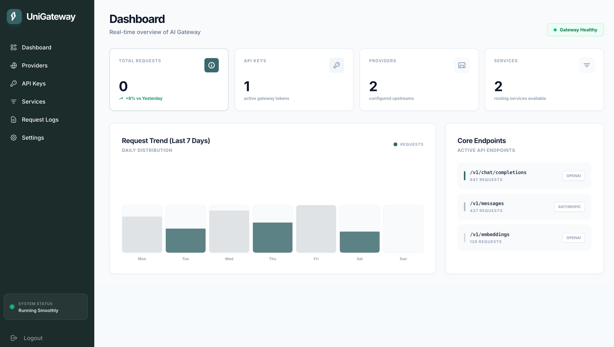

<div align="center">
  <h1>UniGateway</h1>
  <p>
    <strong>A lightweight, open-source LLM gateway with OpenAI and Anthropic compatibility.</strong>
  </p>
  <p>
    Built with Rust for fast startup, low overhead, and simple operations.
  </p>

  <p>
    <a href="https://github.com/lipish/unigateway/actions/workflows/rust.yml"></a>
    <a href="https://crates.io/crates/unigateway"></a>
    <a href="https://github.com/lipish/unigateway/blob/main/LICENSE"></a>
  </p>
</div>

<br />

<p align="center">
  
</p>

## Philosophy

Managing multiple LLM providers (OpenAI, Anthropic, etc.) in production can be complex. **UniGateway** solves this by providing a unified, lightweight proxy layer that sits between your application and the LLM providers.

It offers a **drop-in replacement** for standard OpenAI and Anthropic clients, while adding essential features like request logging, latency tracking, service-based routing, and a built-in admin dashboard without the overhead of a heavyweight API gateway.

## Features

- 🚀 **High Performance**: Built on Rust and Axum for minimal latency and resource usage.
- 🔄 **Unified Interface**:
  - `POST /v1/chat/completions` (OpenAI compatible)
  - `POST /v1/messages` (Anthropic compatible)
- 📊 **Built-in Analytics**: Tracks request counts, status codes, and latency in a local SQLite database.
- 📈 **Minimal Observability**: Exposes `GET /metrics` (Prometheus text format) for external observability integration.
- 🧭 **Service Routing**: Supports `service -> provider` binding with round-robin selection.
- 🔐 **API Key Limits (MVP)**: Supports per-key quota, QPS, and concurrency limits.
- 🛡️ **Refined Admin UI**: A lightweight admin console built with HTMX + DaisyUI, including Providers, API Keys, Services, Request Logs, and Settings.
- 🔎 **Detail Pages**: Providers, API keys, and services can be inspected from dedicated detail views with linked navigation between related resources.
- 🧩 **Product-Oriented Information Architecture**: List pages are optimized for scanability while full relationships are available from detail pages.
- 🧰 **CLI First Operations**: Supports no-UI/headless runtime and admin operations from CLI.
- 📦 **Flexible Deployment**: Run as a standalone binary or embed it as a library in your Rust application.

## Installation

### From Source

Ensure you have [Rust installed](https://rustup.rs/).

```bash
git clone https://github.com/lipish/unigateway.git
cd unigateway
cargo build --release
```

### From crates.io

```bash
cargo install unigateway
```

## Usage

### Running the Server

```bash
# Run with default settings
cargo run --bin unigateway

# Headless mode (no admin UI routes)
cargo run --bin unigateway -- serve --no-ui
```

The server will start on `http://127.0.0.1:3210` by default.

## Admin Experience

The built-in admin UI is designed for operational clarity and lightweight day-to-day management.

- **Providers**
  - Register upstream vendors such as OpenAI, Anthropic, DeepSeek, or custom-compatible backends.
  - Review provider settings from a detail page.
  - Inspect all services currently bound to a provider.

- **API Keys**
  - Create gateway access keys from the UI.
  - Automatically route each key through a service.
  - Inspect an API key and jump to its linked service.

- **Services**
  - Manage the routing layer between API keys and providers.
  - Inspect all bound providers and all API keys using a service.

- **Request Logs**
  - Review recent requests with path, latency, and status.

This makes UniGateway suitable for small teams that want a practical gateway without adding a separate control plane.

### Configuration

UniGateway is configured via environment variables. You can set these in a `.env` file or export them directly.

| Variable | Default | Description |
|----------|---------|-------------|
| `UNIGATEWAY_BIND` | `127.0.0.1:3210` | The address to bind the server to. |
| `UNIGATEWAY_DB` | `sqlite://unigateway.db` | Path to the SQLite database file. |
| `UNIGATEWAY_ENABLE_UI` | `true` | Enable/disable web admin UI routes. |
| `UNIGATEWAY_ADMIN_TOKEN` | `""` | Optional token for admin APIs (`x-admin-token` header). |
| `OPENAI_BASE_URL` | `https://api.openai.com` | Base URL for OpenAI API. |
| `OPENAI_API_KEY` | `""` | Default OpenAI API key (optional). |
| `OPENAI_MODEL` | `gpt-4o-mini` | Default model for OpenAI requests. |
| `ANTHROPIC_BASE_URL` | `https://api.anthropic.com` | Base URL for Anthropic API. |
| `ANTHROPIC_API_KEY` | `""` | Default Anthropic API key (optional). |
| `ANTHROPIC_MODEL` | `claude-3-5-sonnet-latest` | Default model for Anthropic requests. |

### Admin Dashboard

Access the admin dashboard at `http://127.0.0.1:3210/admin`.

- **Username**: `admin`
- **Password**: `admin123` (Default)

> **Note**: The dashboard provides a lightweight operations surface for providers, API keys, services, request logs, and runtime stats.

### CLI Operations

```bash
# Start service with optional overrides
unigateway serve --bind 127.0.0.1:3210 --db sqlite://unigateway.db

# Initialize/reset admin account in DB
unigateway init-admin --username admin --password 'your-password' --db sqlite://unigateway.db

# Print metrics snapshot to stdout
unigateway metrics --db sqlite://unigateway.db

# Create service
unigateway create-service --id svc_openai --name "OpenAI Service" --db sqlite://unigateway.db

# Create provider (returns provider_id)
unigateway create-provider \
  --name openai-prod \
  --provider-type openai \
  --endpoint-id openai \
  --base-url https://api.openai.com \
  --api-key sk-xxx \
  --db sqlite://unigateway.db

# Bind provider to service
unigateway bind-provider --service-id svc_openai --provider-id 1 --db sqlite://unigateway.db

# Create gateway API key with limits
unigateway create-api-key \
  --key ugk_xxx \
  --service-id svc_openai \
  --qps-limit 20 \
  --concurrency-limit 8 \
  --quota-limit 100000 \
  --db sqlite://unigateway.db
```

## API Endpoints

### OpenAI Compatible
```http
POST /v1/chat/completions
Authorization: Bearer <YOUR_OPENAI_KEY>
Content-Type: application/json

{
  "model": "gpt-4o-mini",
  "messages": [{"role": "user", "content": "Hello!"}]
}
```

### Anthropic Compatible
```http
POST /v1/messages
x-api-key: <YOUR_ANTHROPIC_KEY>
anthropic-version: 2023-06-01
Content-Type: application/json

{
  "model": "claude-3-5-sonnet-latest",
  "messages": [{"role": "user", "content": "Hello!"}],
  "max_tokens": 1024
}
```

### Metrics
```http
GET /metrics
```

### Admin APIs (Headless)
```http
GET  /api/admin/services
POST /api/admin/services
GET  /api/admin/providers
POST /api/admin/providers
POST /api/admin/bindings
GET  /api/admin/api-keys
POST /api/admin/api-keys
```

When `UNIGATEWAY_ADMIN_TOKEN` is set, send header:

```http
x-admin-token: <YOUR_ADMIN_TOKEN>
```

## Contributing

Contributions are welcome! Please feel free to submit a Pull Request.

1. Fork the repository
2. Create your feature branch (`git checkout -b feature/amazing-feature`)
3. Commit your changes (`git commit -m 'Add some amazing feature'`)
4. Push to the branch (`git push origin feature/amazing-feature`)
5. Open a Pull Request

## License

This project is licensed under the MIT License - see the [LICENSE](LICENSE) file for details.
