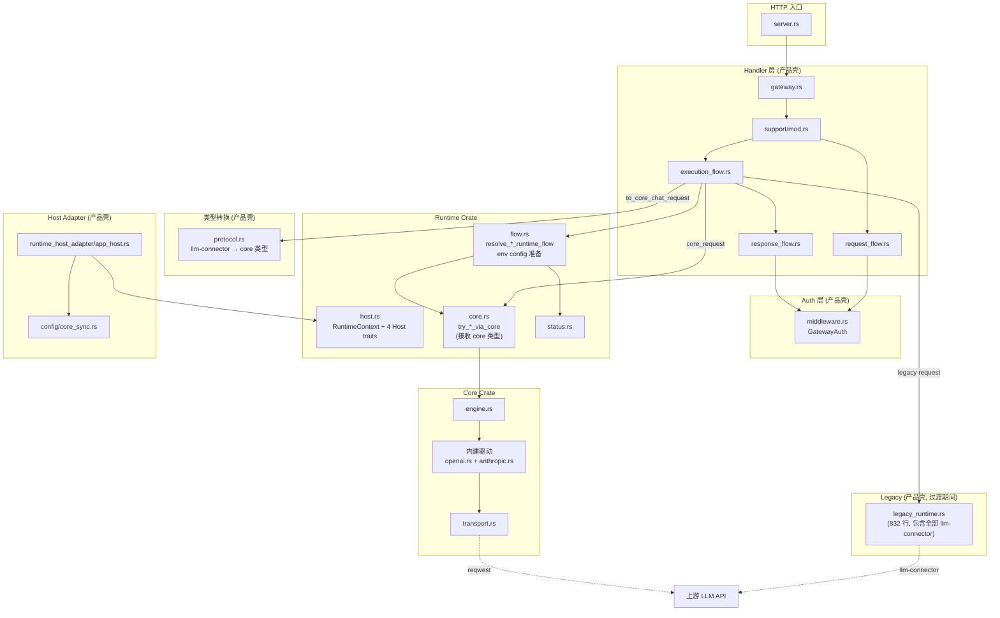

# UniGateway 详细架构分析 — Gemini 任务参考

> 本文档面向执行者（Gemini），提供代码级精确分析。不改代码，只分析。
> 最后更新: 2026-04-06 21:40 (基于 commit `1e215e2` + 未提交的工作区变更)
> 经 Gemini 交叉验证，根因级修正已合入。

---

## 1. 仓库结构概览

```text
unigateway/                           # workspace root + product shell binary
├── Cargo.toml                        # workspace members: [unigateway-core, unigateway-runtime]
│                                     # binary: ug (src/main.rs)
│                                     # 依赖: axum, clap, llm-connector 1.1.9, llm_providers 0.8.1,
│                                     #        unigateway-core (path), unigateway-runtime (path)
│
├── unigateway-core/                  # v0.1.0, 纯内存执行引擎
│   ├── Cargo.toml                    # 依赖: futures, reqwest, serde, tokio, thiserror
│   │                                 # ✅ 无 axum, 无 llm-connector, 无 DB
│   └── src/ (13 files, ~4200 行)
│
├── unigateway-runtime/               # v0.10.2, 可复用运行时层
│   ├── Cargo.toml                    # 依赖: axum 0.7, unigateway-core
│   │                                 # ✅ llm-connector 已移除！
│   │                                 # ⚠️ 仍依赖 axum（返回 axum::Response）
│   └── src/ (5 files, ~1450 行)
│
└── src/ (产品壳, ~9000 行)
    ├── main.rs                       # CLI 入口 (631 行)
    ├── server.rs                     # Axum 路由注册 (74 行)
    ├── gateway.rs                    # 瘦 handler (66 行)
    ├── gateway/support/              # 请求预处理 + 执行编排
    │   ├── mod.rs                    # 4 个 handle_*_request 入口 (97 行)
    │   ├── request_flow.rs           # PreparedGatewayRequest + auth (161 行)
    │   ├── execution_flow.rs         # core-first + legacy 编排 (295 行) ← 大幅简化
    │   └── response_flow.rs          # 统一响应处理 + auth finalize (93 行) ← 新文件
    ├── gateway/legacy_runtime.rs     # 遗留执行路径 (832 行) ← 已整合所有 legacy 代码
    ├── runtime_host_adapter/         # ← 从 runtime/ 重命名
    │   └── app_host.rs              # AppState 实现 4 个 Host trait (56 行)
    ├── config/                       # 配置持久化 + Admin CRUD + Core 同步
    ├── protocol.rs                   # 请求解析 + core 类型转换 (320 行) ← 新增转换函数
    ├── middleware.rs                 # Auth / Quota / Rate Limit
    ├── routing.rs                    # Provider 解析 + hint 提取
    ├── cli/ + setup/                 # CLI 命令 + 交互式 Guide
    └── mcp.rs                        # MCP Server
```

---

## 2. 自上次分析以来的关键变更

### ✅ 已完成: Task 1 — Runtime 层去除 `llm-connector` 依赖

**变更内容**:
- `unigateway-runtime/Cargo.toml` 已移除 `llm-connector` 依赖
- `unigateway-runtime/src/core.rs` 的所有 `try_*_via_core` 函数签名改为接收 core 类型:
  - `request: &ChatRequest` → `request: ProxyChatRequest` (owned, 非引用)
  - `request: &ResponsesRequest` → `request: ProxyResponsesRequest`
  - `request: &EmbedRequest` → `request: ProxyEmbeddingsRequest`
- 类型转换函数 (`to_core_chat_request`, `to_core_responses_request`, `to_core_embeddings_request`, `filtered_response_extra`) 已移到产品壳 `src/protocol.rs`
- `responses_payload_is_core_compatible` 和 `embeddings_payload_is_core_compatible` 保留在 `unigateway-runtime/src/core.rs` 但改为 `pub`，由产品壳调用

**影响**: Runtime crate 现在可以被外部嵌入方（如 OpenHub）使用而不引入 `llm-connector` 依赖。

### ✅ 已完成: Task 2 (部分) — 清理 `#[path]` 文件重映射

**变更内容**:
- `src/runtime.rs` 文件已删除（不再存在）
- 之前通过 `#[path]` 重映射的 4 个文件（`chat.rs`, `streaming.rs`, `responses_compat.rs`, `legacy_runtime.rs`）已整合为单一文件 `src/gateway/legacy_runtime.rs` (832 行)
- `legacy_runtime.rs` 现在包含所有遗留执行逻辑: llm-connector 客户端创建、provider 循环、streaming 适配、responses 兼容性回退
- Host adapter 从 `src/runtime/app_host.rs` 移到 `src/runtime_host_adapter/app_host.rs`

### ✅ 已完成: 执行编排层重构

**变更内容**:
- 新增 `unigateway-runtime/src/flow.rs` — 将执行流控制（core-first → legacy 回退）提升到 runtime 层
  - `resolve_authenticated_runtime_flow(core_attempt, legacy_attempt) -> RuntimeResponseResult`
  - `resolve_env_runtime_flow(core_attempt, legacy_attempt) -> RuntimeResponseResult`
  - `prepare_openai_env_config` / `prepare_anthropic_env_config`
  - `missing_upstream_api_key_response`
  - 错误响应构建 (core_error_response, legacy_error_response, upstream_error_response)
- `execution_flow.rs` 从 475 行缩减到 295 行 — 不再包含 flow 控制逻辑和响应处理
- 新增 `response_flow.rs` (93 行) — 分离出 auth finalize/release + stat recording

**返回类型变更**: flow 函数返回 `RuntimeResponseResult = Result<Response, Response>`（Ok=成功, Err=错误），产品壳的 `response_flow.rs` 负责 auth 生命周期管理和 stat 记录。

---

## 3. 当前三层架构实际状态

### 3.1 `unigateway-core` — 纯内存执行引擎 ✅ 干净

```text
unigateway-core/src/
├── lib.rs              # 公共 API 重导出
├── engine.rs           # UniGatewayEngine: pool CRUD + proxy_chat/responses/embeddings (597 行)
├── pool.rs             # ProviderPool, Endpoint, ExecutionTarget, ExecutionPlan (118 行)
├── routing.rs          # ExecutionSnapshot, Random/RoundRobin 选择 (230 行)
├── retry.rs            # RetryPolicy, BackoffPolicy (49 行)
├── request.rs          # ProxyChatRequest, ProxyResponsesRequest, ProxyEmbeddingsRequest (53 行)
├── response.rs         # ProxySession, StreamingResponse, CompletedResponse, RequestReport (~100 行)
├── error.rs            # GatewayError (~40 行)
├── drivers.rs          # ProviderDriver trait, DriverRegistry trait (~60 行)
├── registry.rs         # InMemoryDriverRegistry (~30 行)
├── hooks.rs            # GatewayHooks trait (~35 行, #[allow(dead_code)])
├── transport.rs        # HttpTransport trait + ReqwestHttpTransport (236 行)
└── protocol/
    ├── mod.rs           # builtin_drivers, report 构建器, SSE 解析 (169 行)
    ├── openai.rs        # OpenAiCompatibleDriver 完整实现 (1195 行)
    └── anthropic.rs     # AnthropicDriver 完整实现 (638 行)
```

**依赖**: futures, reqwest, serde, tokio, thiserror — **零** axum, **零** llm-connector, **零** DB

### 3.2 `unigateway-runtime` — 可复用运行时层 ✅ 大幅改善

```text
unigateway-runtime/src/
├── lib.rs              # pub mod core / flow / host / status (5 行)
├── host.rs             # RuntimeContext, 4 个 Host trait, ResolvedProvider (261 行)
├── core.rs             # try_*_via_core 桥接 + HTTP 响应整形 (959 行) ← 已去除 llm-connector
├── flow.rs             # 执行流控制 + env config 准备 (172 行) ← 新文件
└── status.rs           # 错误码映射 (57 行)
```

**依赖**: axum 0.7, unigateway-core, anyhow, bytes, futures-util, http, serde_json, tokio, tracing
**已移除**: ~~llm-connector~~ ✅

### 3.3 产品壳 `src/` — 请求管线

```text
请求流:
  server.rs → gateway.rs → support/mod.rs
    → support/request_flow.rs   (auth + hint + RuntimeContext 构造)
    → support/execution_flow.rs (core-first + legacy 编排)
    → support/response_flow.rs  (auth finalize + stat recording)

类型转换 (产品壳拥有):
  protocol.rs                   (llm-connector ↔ core 类型转换)

遗留执行路径 (产品壳拥有，仅服务于 legacy):
  gateway/legacy_runtime.rs     (全部 llm-connector 调用集中在此)

宿主能力适配:
  runtime_host_adapter/app_host.rs (AppState 实现 4 个 Host trait)

配置层:
  config/schema.rs + store.rs + admin.rs + select.rs + core_sync.rs
```

---

## 4. 完整请求生命周期追踪（更新版）

以 `POST /v1/chat/completions` 为例:

### 阶段 1-3: HTTP → Handler → 请求预处理（与之前相同）

```
server.rs:60 → gateway.rs:23 → support/mod.rs:18-35
  → request_flow.rs: 构造 RuntimeContext + 提取 auth/token/hint
  → protocol::openai_payload_to_chat_request → llm_connector::ChatRequest
```

### 阶段 4: 执行编排（已重构）

```
execution_flow.rs:26-55 → execute_prepared_openai_chat(...)
    │
    ├── protocol::to_core_chat_request(request)     // ← 在产品壳中转换！
    │       └── ChatRequest → ProxyChatRequest
    │
    ├── 【分支A: 有 GatewayAuth】
    │   └── runtime::flow::resolve_authenticated_runtime_flow(
    │           core: try_openai_chat_via_core(runtime, service_id, hint, core_request),
    │           legacy: legacy_runtime::invoke_openai_chat_via_legacy(runtime, service_id, hint, request),
    │       )  → RuntimeResponseResult
    │
    └── 【分支B: 无 GatewayAuth】
        └── execute_openai_chat_env(prepared, request, core_request)
            └── runtime::flow::resolve_env_runtime_flow(
                    core: try_openai_chat_via_env_core(runtime, hint, core_request, base_url, api_key),
                    legacy: legacy_runtime::invoke_openai_chat_via_env_legacy(base_url, api_key, request),
                )  → RuntimeResponseResult
```

### 阶段 5: 响应处理（新增分离）

```
response_flow.rs:12-25 → respond_prepared_runtime_result(state, prepared, endpoint, result)
    ├── 有 auth → auth.finalize(state) + record_stat (成功) 或 auth.release(state) + record_stat (失败)
    └── 无 auth → record_stat
```

### 关键变化:
1. **类型转换在产品壳发生** — `protocol::to_core_chat_request()` 在 `execution_flow.rs:32` 调用，runtime 只接收 `ProxyChatRequest`
2. **flow 控制在 runtime 层** — `resolve_authenticated_runtime_flow` / `resolve_env_runtime_flow` 返回 `Result<Response, Response>`
3. **auth 生命周期在产品壳** — `response_flow.rs` 负责 finalize/release

---

## 5. 当前 `llm-connector` 使用范围

**已从 Runtime 层完全移除。** 当前仅存在于产品壳:

| 文件 | 使用方式 |
|---|---|
| `src/protocol.rs` | 请求解析 (`ChatRequest`, `EmbedRequest`, `ResponsesRequest`) + core 类型转换 |
| `src/gateway/legacy_runtime.rs` | `LlmClient` 创建 + `chat`/`embed`/`responses`/`chat_stream` 调用 + Streaming 适配 + Responses 兼容性 |
| `src/gateway/support/execution_flow.rs` | 通过函数签名间接引用 (`&ChatRequest`, `&EmbedRequest`, `ResponsesRequest`) |

---

## 6. 剩余架构债务（根因级分析）

> 以下按「根因」而非「现象」层组织。每条指出的不是"哪里看着不对"，而是"什么底层设计决策在阻塞进展"。

### 6.1 ✅ 已解决

- ~~Runtime 层依赖 `llm-connector`~~ → 已移除
- ~~`#[path]` 文件重映射~~ → 已清理，legacy 代码整合到 `legacy_runtime.rs`
- ~~执行编排和响应处理混在一起~~ → 分离为 `execution_flow.rs` + `response_flow.rs`
- ~~类型转换在 Runtime 层~~ → 已移到产品壳 `protocol.rs`

### 6.2 根因 #1: 请求热路径上的 Pool 写锁 (P0)

**现象**: 每次请求都调用 `upsert_pool`，在高并发下争抢 `pools` RwLock 写锁。

**4 处调用位置**:
- `unigateway-runtime/src/core.rs:37-40` — `try_anthropic_chat_via_core`
- `unigateway-runtime/src/core.rs:564-567` — `execute_openai_chat_via_core`
- `unigateway-runtime/src/core.rs:586-589` — `execute_openai_responses_via_core`
- `unigateway-runtime/src/core.rs:141-145` — `try_openai_embeddings_via_core`

**根因**: 产品壳没有在配置变更时主动通知 core engine。`persist_if_dirty()` 已经有 dirty 标记机制（`config/store.rs:61-67`），但当前只用于文件持久化的 30 秒定时任务（`server.rs:23-30`），从未与 core pool 同步绑定。

**启动路径也没有初始同步**: `server.rs:run()` 创建 `AppState` 后直接注册路由，没有将现有 config 的 pool 预加载到 engine 中。pool 的生命周期完全依赖于第一次请求时的 upsert。

**修一点**: 不是仅仅去掉 `upsert_pool` 调用这么简单。需要同时解决：初始加载 + 变更通知 + 并发一致性。

### 6.3 根因 #2: Core 路由策略集不完整 (P1)

**现象**: `fallback` 路由策略的 service 直接绕过 core，走 legacy。

**根因**: `LoadBalancingStrategy` enum 当前只有 `Random` 和 `RoundRobin` — `core_sync.rs:163-173` 中 `to_core_strategy()` 对 `"fallback"` 返回错误，被 runtime `prepare_core_pool()` 捕获后返回 `Ok(None)`，整条请求链回退到 legacy。

**影响范围**: 所有使用 `fallback` 路由策略的 service 的全部请求类型。这是最大的 core 覆盖率瓶颈。

### 6.4 根因 #3: Env-key 模式缺乏 core 路径 (P1)

**现象**: Anthropic env-key 和 Embeddings env-key 请求直接跳过 core。

**精确位置**:
- `execution_flow.rs:270` — `execute_anthropic_chat_env` 中 `std::future::ready(Ok(None))`
- `execution_flow.rs:286` — `execute_openai_embeddings_env` 中 `std::future::ready(Ok(None))`

**根因 (Anthropic)**: 没有 `build_env_anthropic_pool()` 的对应实现。`core.rs` 中只有 `build_env_openai_pool()` (L701-728)，但没有为 Anthropic 构建等价的 env pool。

**根因 (Embeddings)**: 虽然 OpenAI env pool 可以复用，但产品壳选择直接跳过 core（可能是历史原因），而不是直接调用 `try_openai_embeddings_via_core`。

### 6.5 根因 #4: Core 请求模型的语义缺口 — Embeddings (P2，边界决策)

**现象**: `embeddings_payload_is_core_compatible` 只接受 `{model, input}` 两个字段 (runtime `core.rs:766-772`)，导致包含 `encoding_format` 的请求回退到 legacy。

**根因不在于过滤函数太严格，而是 Core API 设计本身没有承载位置**:

```rust
// unigateway-core/src/request.rs:47-52
pub struct ProxyEmbeddingsRequest {
    pub model: String,
    pub input: Vec<String>,
    pub metadata: HashMap<String, String>,
    // ← 没有 encoding_format 字段!
}
```

同时，Core 驱动的 `build_embeddings_request` (`openai.rs:562-578`) 构建的 payload 只包含 `{model, input}` — 即使 `ProxyEmbeddingsRequest` 有了 `encoding_format` 字段，驱动层也不会转发它。

而产品壳 legacy 路径（`protocol.rs:104-107`）**已经**支持 `encoding_format`:
```rust
if let Some(fmt) = payload.get("encoding_format").and_then(Value::as_str) {
    req = req.with_encoding_format(fmt);
}
```

**这是一个 API 设计决策，不是 bug**:
- 方案 A: 给 `ProxyEmbeddingsRequest` 加 `encoding_format: Option<String>` + 驱动层转发 → 解锁更多请求走 core
- 方案 B: 给 `ProxyEmbeddingsRequest` 加 `extra: HashMap<String, Value>` (类似 `ProxyResponsesRequest.extra`) → 更通用但需要驱动层处理
- 方案 C: 保持现状，`encoding_format` 请求继续走 legacy → 如果这个 feature 使用频率极低，不值得为它动 core

> ⚠️ **在这个设计决策没有做出之前，不建议急着把 `embeddings_payload_is_core_compatible` 从 runtime 往产品壳挪** — 那只会把边界判断重新摊回外层，而不会减少真实复杂度。

### 6.6 根因 #5: Engine 单次尝试 + 报告结构写死 (P2)

**现象**: `RetryPolicy` 类型已定义但 engine 仍 single-attempt，`RequestReport.attempts` 始终是单元素。

**精确根因**: `build_request_report` (`protocol/mod.rs:45-73`) 硬编码为创建单个 `AttemptReport`:
```rust
attempts: vec![build_single_attempt_report(
    &endpoint.endpoint_id,
    latency_ms,
    None,   // ← error 固定为 None (成功场景)
)],
```

而 `engine.rs` 中的 `proxy_chat` / `proxy_responses` / `proxy_embeddings` 只做一次尝试：选择 endpoint → 调用 driver → 返回，没有任何循环。`RetryPolicy` 和 `BackoffPolicy` 的字段 (`retry.rs`) 目前 **全部是类型占位符**，没有任何消费者。

与此相关的 `GatewayHooks` trait (`hooks.rs:8`) 也是纯占位符 — `engine.rs:22` 将 hooks 字段标记 `#[allow(dead_code)]`，`on_attempt_started`/`on_attempt_finished`/`on_request_finished` 从未被调用。重试循环实现后才有意义接入。

### 6.7 其他 (P3)

- **Runtime 层仍依赖 `axum`**: `core.rs` 和 `flow.rs` 的函数返回 `axum::response::Response`。对非 Axum 嵌入方（如 OpenHub 使用 Express）是障碍，但按当前 RFC runtime 层定位为 HTTP 兼容层，这被视为可接受。

- **`legacy_runtime.rs` 832 行**: 整合后体量较大，但这是过渡状态。随着根因 #2/#3/#4 的解决，legacy 路径使用频率会降低，该文件会逐步缩小直至删除。

- **兼容性判断函数归属**: `responses_payload_is_core_compatible` / `embeddings_payload_is_core_compatible` 目前在 `unigateway-runtime/src/core.rs` 中 `pub` 导出，由产品壳 `execution_flow.rs` 调用。当根因 #4 的设计决策做出后，这些函数的位置会自然确定 — 如果 core 决定承载更多语义，这些函数应该移入 core；如果保持现状，它们留在 runtime 不会造成问题。

---

## 7. 模块间数据流图（更新版）



---

## 8. 迁移任务清单（更新版，根因对齐）

### ~~Task 1: 将 `llm-connector` 类型转换从 Runtime 移到产品壳~~ ✅ 已完成

### ~~Task 2: 清理 `#[path]` 文件重映射~~ ✅ 已完成

### Task 3: 将 per-request `upsert_pool` 改为事件驱动同步 (对应根因 #1)

**状态**: ⏳ 未开始

**精确调用位置** (4 处):
- `unigateway-runtime/src/core.rs:37-40` — `try_anthropic_chat_via_core`
- `unigateway-runtime/src/core.rs:564-567` — `execute_openai_chat_via_core`
- `unigateway-runtime/src/core.rs:586-589` — `execute_openai_responses_via_core`
- `unigateway-runtime/src/core.rs:141-145` — `try_openai_embeddings_via_core`

**具体步骤**:
1. 在 `server.rs:run()` 启动后立即调用初始同步：遍历现有 config 中全部 service，构建 pool 并 `upsert_pool`
2. 在 `config/admin.rs` 每个写操作后触发 pool 同步（或利用 `dirty` 标记 + 定时检查）
3. 修改 `unigateway-runtime/src/core.rs` 去掉 `upsert_pool` 调用，直接使用 `ExecutionTarget::Pool { pool_id }`
4. 可以在 `GatewayState::persist_if_dirty()` 的同一个 dirty 检查点触发同步（`server.rs:23-30` 的 30 秒定时任务）

**注意**: 不是仅仅去掉 `upsert_pool` 调用这么简单。需要同时解决：初始加载 + 变更通知 + 并发一致性。

### Task 4: 补齐 Core 路径覆盖 — 路由与模式 (对应根因 #2, #3)

**状态**: ⏳ 未开始

**子任务 4a**: Core 支持 `fallback` 路由策略 — **最大覆盖率瓶颈**
- `LoadBalancingStrategy` 加 `Fallback` → `routing.rs` 实现按 endpoint 插入顺序选择 → `core_sync.rs:164` 加映射
- 同时确保 core 路由在第一个 endpoint 失败后能按顺序尝试下一个（与 Task 5 的重试循环有交集）

**子任务 4b**: Core 路径支持 Anthropic env-key 模式
- `execution_flow.rs:270` 当前固定为 `std::future::ready(Ok(None))`
- 需要在 `core.rs` 中添加 `build_env_anthropic_pool()` (参考现有的 `build_env_openai_pool` L701-728)
- 然后在 `execution_flow.rs` 中调用 `try_anthropic_chat_via_core` 替换 `Ok(None)`

**子任务 4c**: Core 路径支持 Embeddings env-key 模式
- `execution_flow.rs:286` 同理
- 可以直接复用现有的 `build_env_openai_pool` 并调用 `try_openai_embeddings_via_core`

### Task 4d: Embeddings Core API 设计决策 (对应根因 #4)

**状态**: ⏳ 需要先做设计决策

**这不是简单的"放宽兼容性检查"**。需要同时修改三处：
1. `ProxyEmbeddingsRequest` 的字段（`request.rs:47-52`）
2. `build_embeddings_request` 的 payload 构建（`openai.rs:562-578`）
3. `to_core_embeddings_request` 的转换逻辑（`protocol.rs:141-147`）

在决策之前，建议先确认 `encoding_format` 的实际使用频率。如果几乎没有客户使用，可以推迟。

### Task 5: Engine 层实现重试循环 + Hooks (对应根因 #5)

**状态**: ⏳ 未开始

需要修改的具体位置：
- `engine.rs` 的 `proxy_chat/proxy_responses/proxy_embeddings`: 加入重试循环
- `protocol/mod.rs:45-73` 的 `build_request_report`: 改为接收 `Vec<AttemptReport>` 而非硬编码单元素
- `hooks.rs:8-13` 的 `GatewayHooks`: 在重试循环中调用 `on_attempt_started/finished`
- `engine.rs:22` 的 `#[allow(dead_code)]` hooks 字段: 去掉标注并实际使用

> 注意: Task 4a (fallback) 和 Task 5 (retry) 有交集 — fallback 的"按顺序尝试下一个"语义本质上是一种特化的 retry 循环。建议先做 Task 5 再做 4a，或者一起设计。

---

## 9. 代码量分布（更新版）

| 区域 | 行数 | 占比 |
|---|---|---|
| 产品壳 `src/` | ~9,000 | 62% |
| Core `unigateway-core/src/` | ~4,200 | 29% |
| Runtime `unigateway-runtime/src/` | ~1,450 | 10% |
| **合计** | **~14,650** | 100% |

### 产品壳关键文件大小变化

| 文件 | 旧行数 | 新行数 | 变化 |
|---|---|---|---|
| `execution_flow.rs` | 475 | 295 | -38% (flow 逻辑移至 runtime) |
| `legacy_runtime.rs` | 217 | 832 | +283% (整合了 chat.rs, streaming.rs, responses_compat.rs, protocol/client.rs) |
| `protocol.rs` | 266 | 320 | +20% (新增 core 类型转换函数) |
| `gateway/chat.rs` | 78 | 已删除 | -100% |
| `gateway/streaming.rs` | 100 | 已删除 | -100% |
| `gateway/responses_compat.rs` | 249 | 已删除 | -100% |
| `protocol/client.rs` | 158 | 已删除 | -100% |
| `protocol/messages.rs` | ~60 | 已删除 | -100% |
| `response_flow.rs` | 不存在 | 93 | 新文件 |
| `runtime.rs` | 41 | 已删除 | -100% |
| `runtime/app_host.rs` → `runtime_host_adapter/app_host.rs` | 57 | 56 | 基本不变 |

### Runtime Crate 变化

| 文件 | 旧行数 | 新行数 | 变化 |
|---|---|---|---|
| `core.rs` | 1064 | 959 | -10% (移除转换函数 + llm-connector 引用) |
| `flow.rs` | 不存在 | 172 | 新文件(从产品壳 execution_flow.rs 提取) |
| `host.rs` | 261 | 261 | 不变 |
| `status.rs` | 57 | 57 | 不变 |

---

## 10. 迁移进度评估（更新版）

| Phase | 目标 | 状态 | 备注 |
|---|---|---|---|
| **Phase 0** | 锁定边界和命名 | ✅ 完成 | |
| **Phase 1** | 引入 Core 类型系统 | ✅ 完成 | |
| **Phase 2** | 提取纯内存引擎 | ✅ 完成 | |
| **Phase 3** | 替换 `llm-connector` | ✅ **Runtime 层完成** | Runtime 已无 llm-connector 依赖; 产品壳中 legacy 路径仍用 |
| **Phase 4** | Handler 瘦化 | ✅ **大部分完成** | gateway.rs 66 行; execution_flow.rs 295 行; flow 逻辑已提取到 runtime |
| **Phase 5** | 产品关注点外推 | 🔄 进行中 | auth/quota 已分离到 response_flow; 但 per-request upsert_pool 仍在 |
| **Phase 6** | 稳定化 + 公共 API | ⏳ 未开始 | |

---

## 11. 推荐优先级排序

基于根因分析和交叉验证，建议执行顺序：

1. **Task 3 (Pool 同步)** — 这决定了 runtime 是不是"执行时只做执行"。是结构性问题。
2. **Task 4a (fallback 策略)** — 最大的 core 覆盖率瓶颈。但与 Task 5 有交集。
3. **Task 5 (重试循环)** — fallback 的"按顺序尝试"本质上是特化的 retry。建议和 4a 一起推进。
4. **Task 4b/4c (env-key core 路径)** — 实现工作量较小，但需要 Task 3 先完成（否则 env pool 也是 per-request upsert）。
5. **Task 4d (embeddings 设计决策)** — 先确认使用频率再决定。不急。
